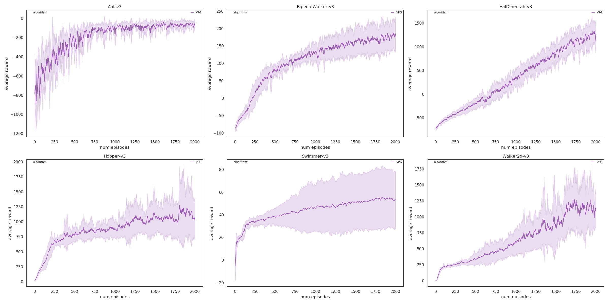
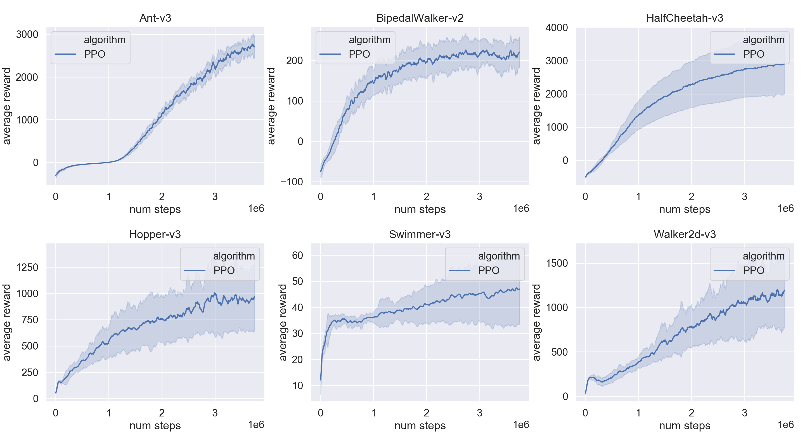
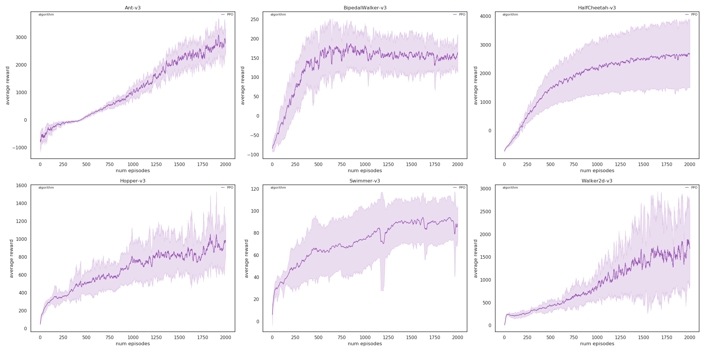
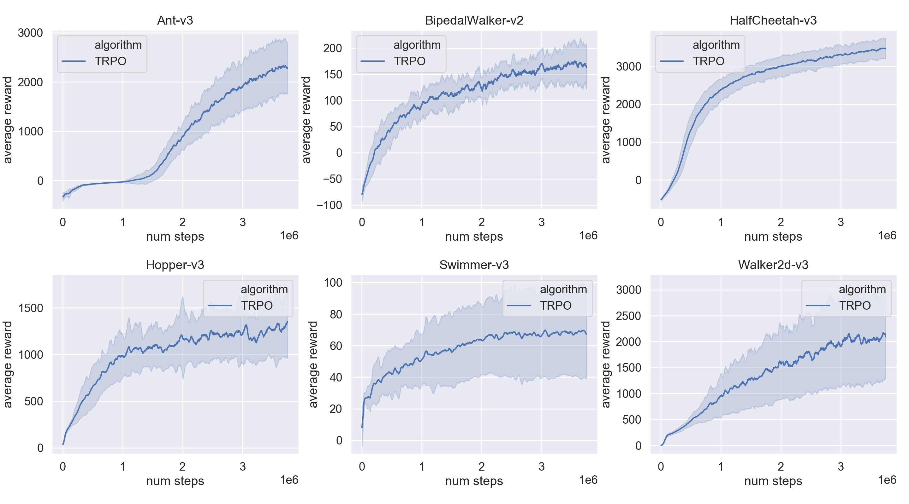
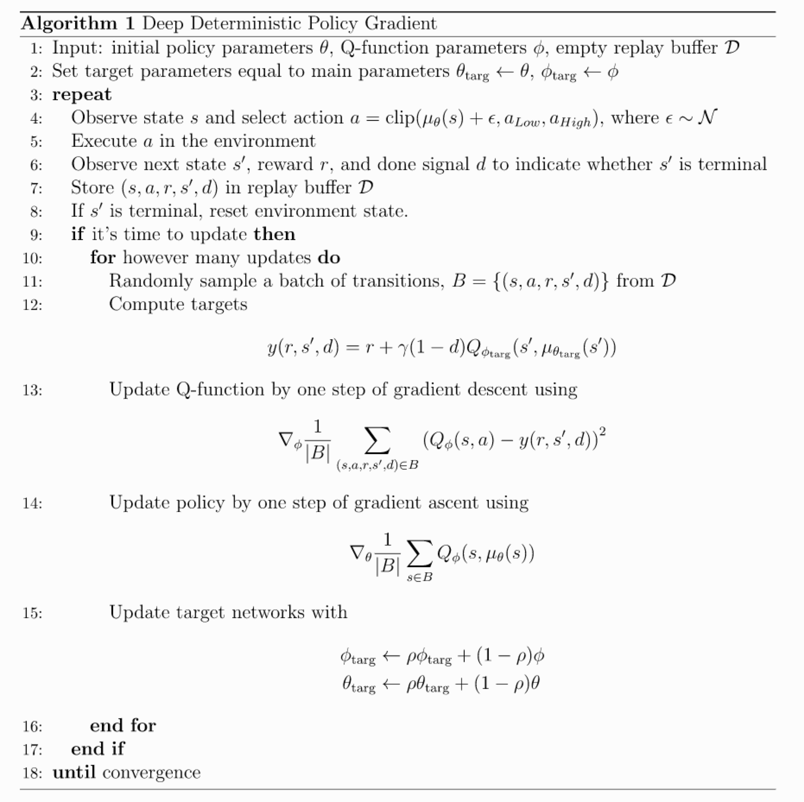

# DeepRL 算法小结

## DQN 系列算法

DQN 是 Deep Reinforcement Learning 的入门级算法。

Deep Q-learning Network 基于 `Q-learning` 是 `off-policy` 算法。它使用一个`Q`网络估计 action-value 映射函数，
使用 Experience-Replay 采样，可有效提升 data efficiency。

### 算法细节及论文

#### 1.Basic DQN [Playing Atari with Deep Reinforcement Learning][1]

#### 2.Double DQN [Deep Reinforcement Learning with Double Q-learning][2]

与 Basic DQN 不同，这里使用了两个网络。一个作为在线更新 -> 训练网络(train net)，另一个用于策略评估 -> 目标网络(target policy)。
在更新上，训练网络立即更新,而目标网络的更新存在一个滞后性(freeze)；策略评估中，用训练网络找到最优动作:

$$a_{t + 1} =  \arg \max_{a \in A} \left[ r(s_{t}, a_{t}) + \gamma Q(s_{t + 1}, \arg \max_{a \in A} Q^{target} (s_{t + 1}, a_{t + 1}) ) \right]$$
 
基于 `train net` 进行采样，而使用 `target net` 进行评估。

Double DQN 的动作值估计形式如下(论文中说对偶形式等价即交换$\theta_t$和$\theta_t^{'}$):

*DDQN算法流程如下*:

#### 3.Dueling DQN [Dueling Network Architectures for Deep Reinforcement Learning][3]

更改 Basic DQN 的网络结构.

使用优化技巧使网络平衡地更新到 state value 和 advantage action(state-dependent) value.

### 实践效果

在gym的经典环境中的表现：

Double DQN的效果似乎不尽人意，可能实现存在bug。

### Policy Gradient 系列算法

基于策略的梯度算法，包括 Vanilla Policy Gradient(REINFORCE)，以及 TRPO， PPO， DDPG 等算法.

在理解算法的过程中，有一个难点是对于策略函数 $\pi(a | s, \theta)$ 的梯度优化计算原理，因为策略函数是一个概率分布，

其梯度计算依赖于对分布的随机采样， `Pytorch` 等计算图框架中封装了这类的算法，其梯度计算原理见 [Gradient Estimation Using Stochastic Computation Graphs][4]。

PG算法主要有两大类:
- `On-policy`: REINFORCE(VPG)， TRPO， PPO (on-policy 算法基于当前策略进行采样, 因此 sample efficiency 较低)；
- `Off-policy`: DDPG， TD3， SAC (off-policy 算法可以充分利用 old data, 因此 sample efficiency 较高, 相应地它无法确保策略的表现是否足够好)。

两类算法的发展主要是针对各自的问题进行相应地优化, 但它们本质上都是对策略(Policy)的优化。

### 算法细节及论文

#### 1.[REINFORCE][5]

这算是 PG 最基本门的算法了，基于轨迹更新。当然也有基于 time step更新的版本， 可以理解为将算法中第二步中对于 $i$ 的求和式进行分解。
其算法流程如下:

##### 实践效果
在 `gym` 的经典游戏 `MountainCar-v0` 中的表现：

    
    

#### 2.[VPG][6]

可以证明，引入Baseline的策略梯度仍是无偏的，同时它能够有效降低方差。
这里的Baseline为之后的 GAE(Generalized Advantage Estimation) 提供了方向， [GAE论文](https://arxiv.org/abs/1506.02438) 详细阐述了用Advantage更新的变种和优点。
之后的 PG 算法都将基于 GAE 。

    

可以看到，baseline 版本的 reward 曲线更加平稳，这就是 baseline 的重要作用：降低 Value Net 估计值的方差。

VPG 在 [Mujoco](https://gym.openai.com/envs/#mujoco) 环境上的表现:

**Pytorch 版本**

**Tensorflow2 版本**

#### 3.[PPO (Proximal Policy Optimization)][7]

这里把 PPO 放在 TRPO 之前，原因是其原理和形式简单，实现上也相对简单，其性能接近 TRPO ，实践效果较好。在 PG 算法中，PPO 目前已经成为主流算法。

PPO 能胜任较为复杂的控制任务，在 `Mujoco` 环境中已经能获得不错的效果。

PPO 是 TRPO 的变种，其优化目标是 Surrogate Loss:

其中 $\epsilon$ 是参数，一般取`0.1 - 0.2`，该目标确保更新策略参数靠近原策略参数，这也就是Proximal的来源。

其算法流程如下:

##### 实践效果

在 `gym` 的 Box2d 环境下 [BipedalWalker-v2](https://gym.openai.com/envs/BipedalWalker-v2/) 中的表现(参数方面我参照了比较官方的参数）：

        
        
        

PPO 在 Mujoco 环境上的表现:

**Pytorch 版本**

**Tensorflow2 版本**

实现了基于 [mini_batch](PPO/ppo_mini_batch.py) 和 [target policy](PPO/ppo.py) 两个版本，两个版本的区别在于是否使用 `mini batch` 
进行更新。两者在性能上还是有一定的差异的，从两者在 `BipedalWalker-v2` 上的表现来看，`target policy` 版本更稳定，在数据量较大时，将倾向于使用
`mini batch` 进行更新。

#### 4.[TRPO(Trust Region Policy Optimization)][8]

TRPO 的原理事实上是不难理解的，但在其推导过程中使用了较多的数学技巧。它对于优化目标使用一阶近似，对优化约束使用二阶近似。
TRPO 的目标中考虑了 new policy 对于 old policy 的提升，同时又要限制 new policy 与 old policy 之间过大的差异。论文里
使用 `KL-Divergence` 作为策略之间的 `距离`。

实现中，考虑了对优化问题的近似。这里给出一个完整的 TRPO 的近似目标推导: [Deriviation of TRPO.pdf](TRPO/Deriviation%20of%20TRPO.pdf)

其算法流程如下:

##### 实践效果

TRPO 在 `Mujoco` 环境上的表现:

这里的 TRPO 表现似乎优于 PPO :(，不过其实现和计算资源耗费相较更多，也不太适合使用 `mini batch`。

#### 5.[DDPG(Deep Deterministic Policy Gradient)][9]

与以上算法优化的随机策略不同，这里我们优化的是一个确定性策略，它源于 David Silver提出的[Deterministic Policy Gradient Algorithms][10]。

`Deterministic Policy` 的特点在于 $\pi (s_{t}) = a_{t}$ 是确定的，而 `random policy`下 $a_{t} \sim \pi (s_{t})$
是一个概率分布。

如果翻阅论文其实会发现，它和随机策略算法类似。

其算法流程如下:

##### 实践效果

DDPG 在 `Mujoco` 环境上的表现:

待完善，还没跑完实验

#### 6.[TD3(Twin Delayed DDPG)][11]

其名 `Twin Delayed Deep Deterministic Policy Gradient`，从名字可以看出来，该算法是对于 `DDPG` 的改进。
其改进主要有三点:

1. Clipped Double Q-learning -> 使用两个 Critic， 这与 `Double DQN` 非常类似；
2. Delay policy updates -> 对 Policy 更新频率减慢；
3. Target policy smoothing -> 给 Target policy 增加噪声。

论文主要的思想是基于 DDPG 容易产生 `over-estimate` 现象展开，这里对我们设计 RL 算法提供了一些思考：
它们是否还有缺点或者可以改进的地方？如何改进？

其算法流程如下:

##### 实践效果

TD3 在 `Mujoco` 环境上的表现:

待完善，还没跑完实验

[1]: https://arxiv.org/abs/1312.5602
[2]: https://arxiv.org/abs/1509.06461
[3]: https://arxiv.org/abs/1511.06581
[4]: https://arxiv.org/abs/1506.05254
[5]: https://papers.nips.cc/paper/1713-policy-gradient-methods-for-reinforcement-learning-with-function-approximation.pdf
[6]: https://spinningup.openai.com/en/latest/algorithms/vpg.html
[7]: https://arxiv.org/abs/1707.06347
[8]: https://arxiv.org/abs/1502.05477
[9]: https://arxiv.org/abs/1509.02971
[10]: http://proceedings.mlr.press/v32/silver14.pdf
[11]: https://arxiv.org/abs/1802.09477
